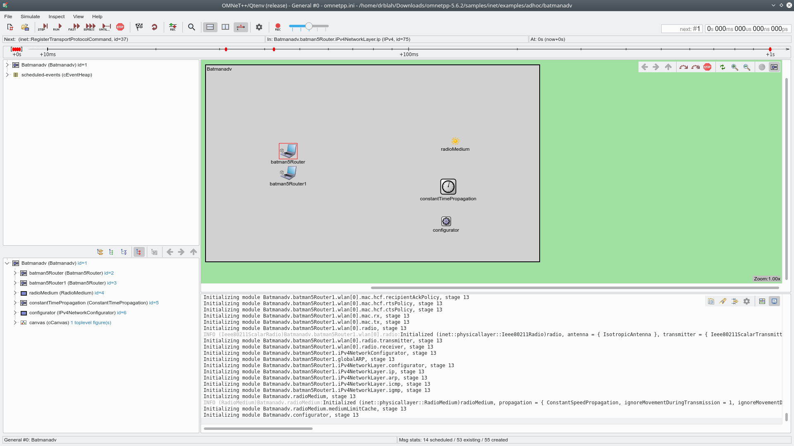

# OMNETpp-batmanV
An example of running BATMAN V in the OMNET++ network simulator. The BATMAN model is made by [BenSliwa](https://github.com/BenSliwa/rawData_batmanV)

## How to
1. Get the latest omnet++ (5.6.2): https://omnetpp.org/download/
    - Install using the official install guide: https://doc.omnetpp.org/omnetpp/InstallGuide.pdf
    - If OMNET++ offers to install inet automatically, DON'T. We will need another version.
    
2. Get the latest LEGACY inet (3.6.7): https://inet.omnetpp.org/Download.html
    - It is the second large blue button
    - Install using the manual installation guide found on: https://inet.omnetpp.org/Installation.html

3. Clone this repository to get the Batman5 model and the simulation scenario
    - I have modified BenSliwa's Batman5 model slightly by removing his movement predictive routing. This should **hopefylly** leave us with a pretty standard BATMAN V protocol.
  
4. Install the Batman5 model
    - Copy the Batman5 directory into inet/src/inet/

5. Install the simulation
    - Copy the batmanadv directory it into inet/examples/adhoc/
  
6. Test run the simulation
    - Open omnet++ and navigate to inet/examples/adhoc/batmanadv/ in the project explorer on the left
    - Right click Batmanadv.ned and "Run As" -> OMNET++ simulation
    - Everything should be compiled now and a new simulation window should appear
    - Fill in the following values when prompted:
      - propagationType : "ConstantSpeedPropagation"
      - pathLossType    : "FreeSpacePathLoss"
      - analogModelType : "ScalarAnalogModel"
    - Click "step" (top left) to step through the simulation and see the output in the console. ( and enjoy the fancy visuals :) )

7. Running simulation
    - You should now have something like this running in the simulation window:

## How did I make the simulation?
- I added a new simulation by right clicking the inet/examples/adhoc directory and choosing New -> Simulation
  - Fill out the name and select "An empty simulation" as the template
  - This creates a new directory containing a *.ned file which is the simulation "specification". This file is a plain text file and can be edited both as text and using a visual editor. I did both. (You can choose which mode is used by right clicking the file in Project Explorer and choosing "Open with")
  - Edit the new *.ned file in the text editor and add: "import inet.Batman5.node.Batman5Router;"
  - Save the file and re-open it in the NED editor. This should show a visual, drag-and-drop interface. 
  - Drag a new "Network" from the Types menu
  - Find the Batman5Router and drag at least one device to the
  - Add a radioMedium.
  - Add constantTimePropagation
  - Add a IPv4NetworkConfigurator and rename it to "configurator"
  - Run the simulation
